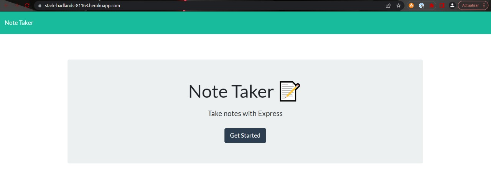
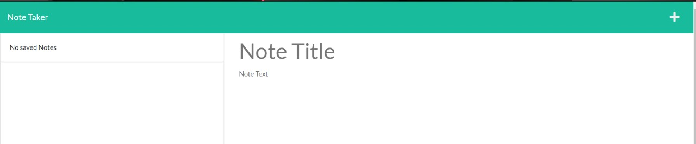
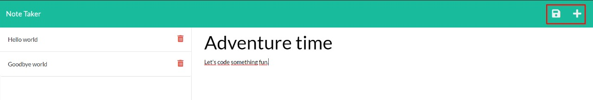
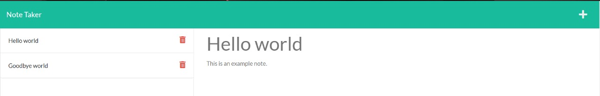

# Note Taker

## User Story

```
AS A small business owner
I WANT to be able to write and save notes
SO THAT I can organize my thoughts and keep track of tasks I need to complete
```

## Acceptance Criteria

```
GIVEN a note-taking application
WHEN I open the Note Taker
THEN I am presented with a landing page with a link to a notes page
WHEN I click on the link to the notes page
THEN I am presented with a page with existing notes listed in the left-hand column, plus empty fields to enter a new note title and the note’s text in the right-hand column
WHEN I enter a new note title and the note’s text
THEN a Save icon appears in the navigation at the top of the page
WHEN I click on the Save icon
THEN the new note I have entered is saved and appears in the left-hand column with the other existing notes
WHEN I click on an existing note in the list in the left-hand column
THEN that note appears in the right-hand column
WHEN I click on the Write icon in the navigation at the top of the page
THEN I am presented with empty fields to enter a new note title and the note’s text in the right-hand column
```

## Deployed app

### URL: https://stark-badlands-81163.herokuapp.com/

You will be displayed with the main page. Clicking on "Get Started" will take you to the
note taker to start.



In the note taker you will find all available notes or either no notes.
You can start by adding a new one clicking in the top-right corner plus sign button.
This will display in the right column an empty title and body for your new note.



When your note has a title and body a "save" button will be displayed in the top-right corner
besides the add button. Clicking in the save button will make your note available in the left column
for you to check it whenever you want by clicking on it.



Finally, you will see all your notes in the left-hand column with a small trash can icon in case
you want to delete that note.

